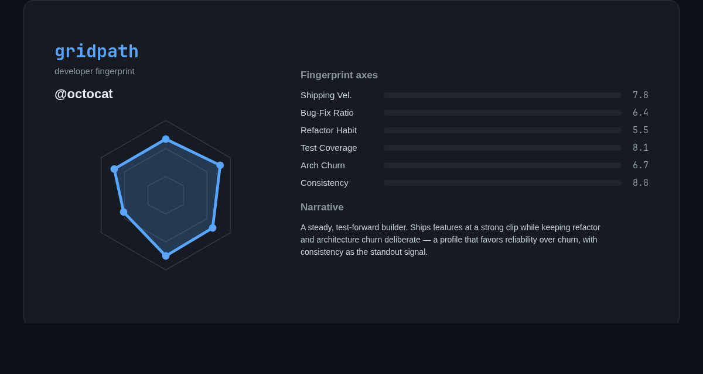

<!-- Public, open-source reference implementation · MIT -->
> **GridPath** turns your GitHub commit history into a developer fingerprint: a six-axis radar, an AI-written narrative, and a shareable card.
>
> **This repo is the source code.** It is not deployed — there is no live demo. The static showcase lives at [agilap/gridpath-landing](https://github.com/agilap/gridpath-landing). To run GridPath, clone this repo and follow the Local Setup below.

---

# GridPath

GridPath reads your GitHub commit history, classifies every commit (feature, bugfix, refactor, test, docs, chore, architecture) via AST + regex, scores six behavioral axes, and renders your build style as a fingerprint: a radar chart, a short AI narrative, and a shareable card.

- **Classifier & fingerprint engine** — zero API calls, fully deterministic
- **AI narrative** — one OpenAI call turns the fingerprint into a two-paragraph story (graceful fallback if the API is down)
- **Shareable card** — a Wrapped-style PNG composited with Pillow from the Plotly radar
- **Private repos** — optional GitHub OAuth; tokens are encrypted server-side

## Stack

| Layer | Tech |
|---|---|
| Frontend | React 18 · Vite · TypeScript · Tailwind · Plotly |
| Backend | FastAPI · Celery (async pipeline) |
| Data | Supabase (Postgres + Storage) · Upstash Redis (broker/cache) |
| AI | OpenAI (single narrative call) |

## Showcase

A static, no-demo landing page (the visual identity, not the running app) is at **[agilap/gridpath-landing](https://github.com/agilap/gridpath-landing)**.

## Local Setup

1. Copy the env templates and fill them in:
   - `cp .env.example .env`
   - `cp frontend/.env.example frontend/.env`
   - Required: Supabase (`SUPABASE_URL`, `SUPABASE_ANON_KEY`, `SUPABASE_SERVICE_ROLE_KEY`), Upstash (`UPSTASH_REDIS_URL`, `rediss://`), GitHub OAuth (`GITHUB_CLIENT_ID`, `GITHUB_CLIENT_SECRET`), and `OPENAI_API_KEY`.
2. Apply the SQL migrations in `backend/supabase/migrations/` via the Supabase CLI or SQL Editor.
3. Create a public Supabase Storage bucket named `cards`.
4. Start everything: `docker compose up` (runs the FastAPI app + Celery worker).
5. Frontend dev server: `cd frontend && npm install && npm run dev`.

## GitHub OAuth App (for private repos)

Register one GitHub OAuth App:

- **Application name:** GridPath
- **Homepage URL:** `http://localhost:5173`
- **Authorization callback URL:** `http://localhost:8001/api/auth/callback`

Set `GITHUB_CLIENT_ID`, `GITHUB_CLIENT_SECRET`, and `GITHUB_REDIRECT_URI` in your `.env`.

## Project Layout

```
backend/app/
  core/        classifier · fingerprint · github_client · narrative
  api/         FastAPI routes (auth, profile, share)
  tasks/       Celery async analysis pipeline
  card/        Pillow share-card generator
  db/          Supabase + Upstash clients
  tests/       Pytest suite
frontend/src/
  components/  RadarChart · NarrativePanel · ShareableCard · ...
  pages/       Home · Profile · Shared
  lib/         api client · supabase · constants
```

## Example

A generated fingerprint for `@octocat`:



Six scored axes — Shipping Velocity, Bug-Fix Ratio, Refactor Habit, Test Coverage, Architecture Churn, Consistency — feed a radar chart and a short AI-written narrative, composited into a shareable 1200×630 card.

## Limitations

- **Not deployed.** This repository is published as a reference implementation; there is no hosted instance. Run it locally (see Local Setup).
- **Requires external services.** Supabase, Upstash Redis, GitHub OAuth, and an OpenAI key must be provisioned by you — the app does not run with zero config.
- **Narrative needs an API key.** The fingerprint and radar work without OpenAI; the narrative falls back to a static summary if `OPENAI_API_KEY` is absent.
- **GitHub rate limits.** Large histories are paginated and may hit GitHub's unauthenticated/authenticated rate ceiling; private-repo analysis requires the OAuth flow.

## License

MIT — see [LICENSE](./LICENSE).
